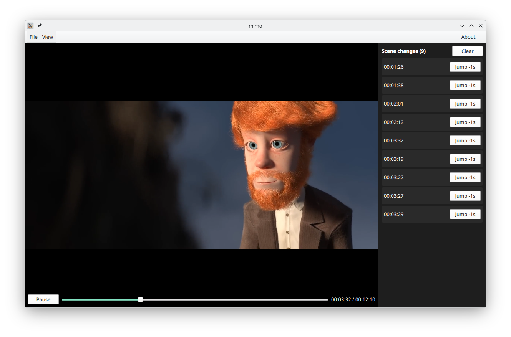

___

Simple Qt QML6 application for testing the cosene distance function for detecting scene changes (or abrupt changes between 2 frames)

> Video is Cosmos Laundromat - First Cicle by the Gooseberry Open Movie project (CC) Blender Foundation | 

# License
GNU GPL v3
